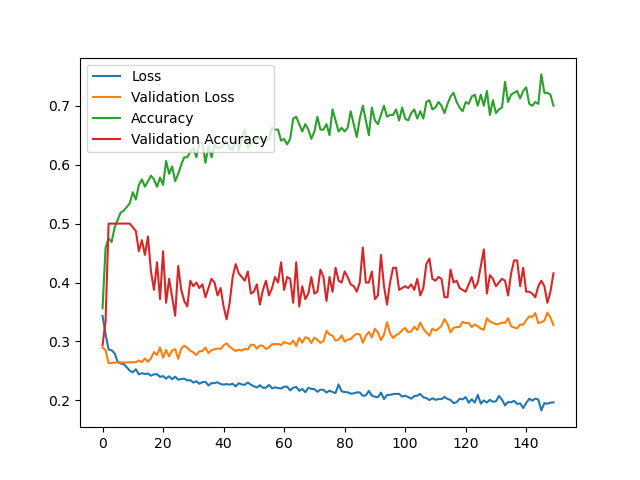

# Face Recognition with a Custom Siamese Neural Network

In this data science project, I am pioneering a state-of-the-art facial recognition system by employing a custom-designed Siamese neural network architecture. Leveraging the power of transfer learning, the model is trained on a dataset containing my classmates' faces, achieving remarkable accuracy in individual face recognition. This project not only delves into advanced techniques in facial recognition but also explores the practical application of the technology. The potential use cases extend to efficient attendance management in educational institutions or workplaces, showcasing the versatility and real-world applicability of the developed model.

# Business Understanding and Data Understanding

The project addresses the growing demand for robust and accurate facial recognition systems in various domains. Facial recognition has gained prominence in security, attendance management, and user authentication. With the advent of deep learning techniques, there is a continuous effort to enhance the performance of such systems. The project aims to contribute to this field by utilizing a custom Siamese neural network, a powerful architecture known for its effectiveness in face recognition tasks.

To train the custom Siamese neural network, I first used the Olivetti dataset from Tensorflow to ensure the model's robustness, then I used a dataset comprising of the faces of my classmates. The dataset is diverse, covering different facial expressions, lighting conditions, and angles to ensure the model's robustness.

# Modeling and Evaluation
What kind of model(s) did you use?
How well did your final model perform, compared to the baseline?

The baseline model for this project is a custom Siamese network utilizing the contrastive loss function to measure loss. It achieved 99% training accuracy on the Olivetti dataset and 91% accuracy on the validation.

# Conclusion
How would you recommend that your model be used?

# Repository Navigation
An explanation of the repository organization
Links to the final notebook and presentation
As a reminder, the Markdown notation for a link is [link text](/path/to/file)
Reproduction instructions (or a link to them)
