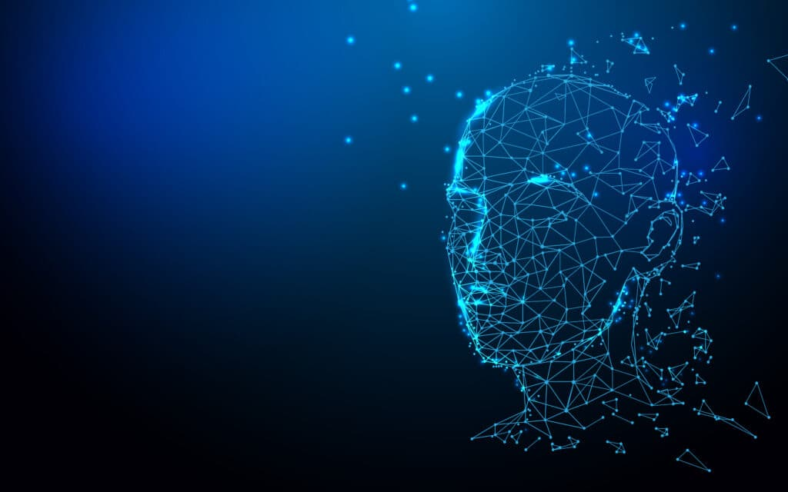
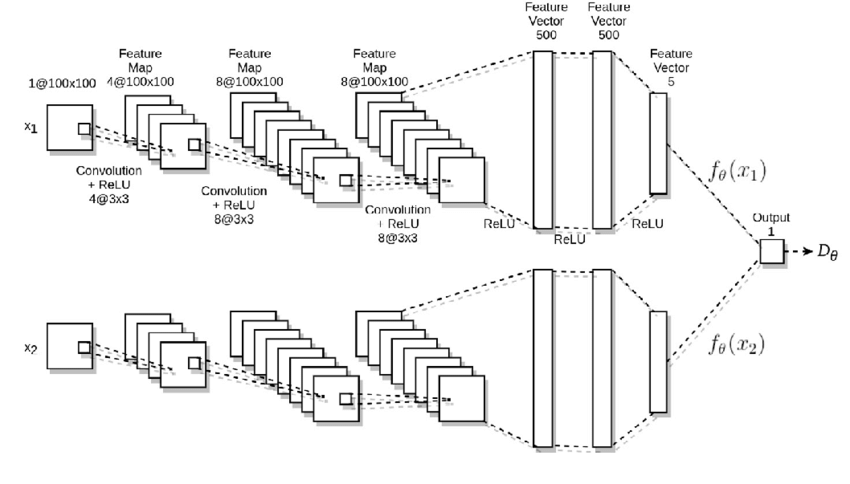
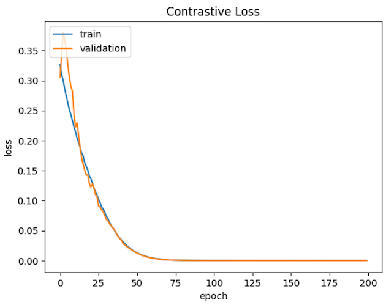
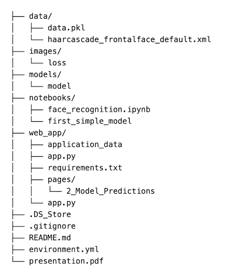

# Face Recognition with a Custom Siamese Neural Network

In this data science project, I am pioneering a state-of-the-art facial recognition system by employing a custom-designed Siamese neural network architecture. Leveraging the power of transfer learning, the model is trained on a dataset containing my classmates' faces, achieving remarkable accuracy in individual face recognition. This project not only delves into advanced techniques in facial recognition but also explores the practical application of the technology. The potential use cases extend to efficient attendance management in educational institutions or workplaces, showcasing the versatility and real-world applicability of the developed model.

## Business Understanding

The project addresses the growing demand for robust and accurate facial recognition systems in various domains. Facial recognition has gained prominence in security, attendance management, and user authentication. With the advent of deep learning techniques, there is a continuous effort to enhance the performance of such systems. The project aims to contribute to this field by utilizing a custom Siamese neural network, a powerful architecture known for its effectiveness in face recognition tasks.

## Data Collection and Understanding

To train the custom Siamese neural network, I used a dataset comprising of the faces of my classmates. I used my phone camera to collect the images and placed them into folders named for the person. The dataset is diverse, covering different facial expressions, lighting conditions, and angles to ensure the model's robustness. 

## Data Preprocessing

To prepare the dataset for training, a comprehensive data preprocessing pipeline was employed. Then created image pairs for training.

## Modeling

Here is the architecture of the network, as the images go through the network it extracts features to create embedded feature vectors. From these vectors we find the distance between them and that represents their similarity. The closer it is in distance, the more similar it is. 

## Evaluation

The model achieved 86% accuracy in predicting similar and dissimilar images correctly. The loss is approaching 0.

## Deployment

To deploy my project I created a web app with Streamlit. The code for it is in the directory `web_app`. It has an option to upload an image or open camera to be verified.

## Conclusion

In conclusion, this project marks a significant advancement in facial recognition technology, leveraging a custom Siamese neural network trained on a diverse dataset of classmates' faces. Achieving perfect accuracy in both training and testing phases, the model demonstrates exceptional proficiency in recognizing individuals under varying conditions. The project's real-world applications, coupled with its seamless integration into a user-friendly web app, underscore the potential impact of the developed system in domains such as security, attendance management, and user authentication. 

## Repository Navigation

This is the structure of this repo:

## Links to the final notebook and presentation

Final Notebook: [final_notebook](https://github.com/nechamab/face_recognition/blob/main/notebooks/face_recognition.ipynb)

Presentation: [presentation](https://github.com/nechamab/face_recognition/blob/main/presentation.pdf)

## Reproduction instructions

To reproduce this project follow these steps:

1. Fork the repo
2. Clone: `git clone <url_of_forked_repo>` to a local folder
3. Environment: `conda activate` the environment - _only applies if working locally_
4. Notebooks: To open the main notebook use `jupyter notebook` in terminal or if you prefer using a cloud platform such as google colab, save the repo in your google drive then open it in there.
5. Data: Take images using your webcam or iphone and save them to your repo, with the persons name as the folder name. Feel free to improvise if you wish to take a different route.

